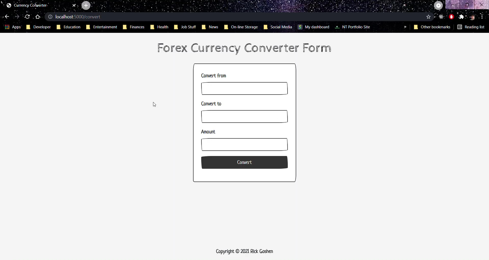
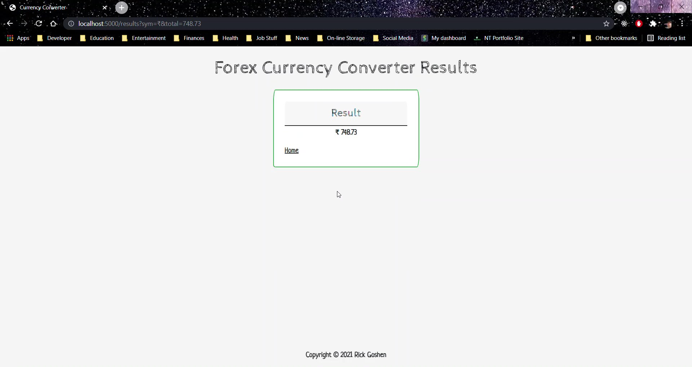
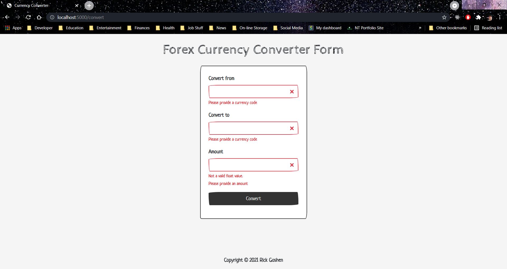
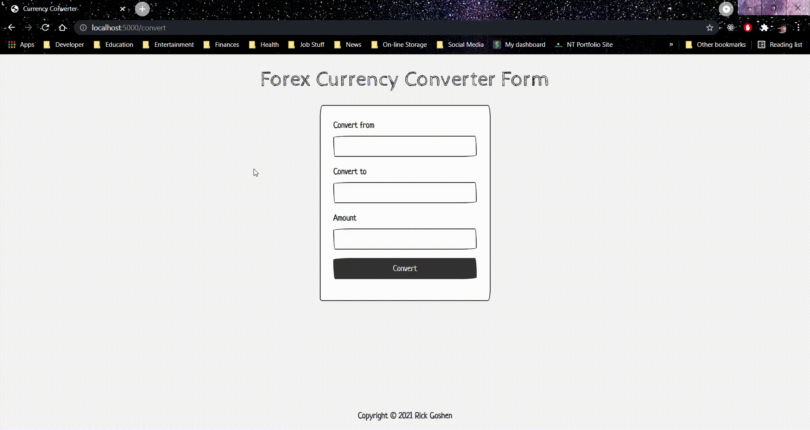

# Forex Currency Converter

## Table of Contents

- [About](#about)
- [Demo](#demo)
- [Getting Started](#getting_started)

## About <a name = "about"></a>

This is an app built for a Springboard assessment.  It focuses on using Python and Flask for the backend and standard HTML basic CSS for the frontend.  It uses the <a href="https://pypi.org/project/forex-python/">forex-python</a> module for free foreign excahnge rates adn currency conversion.

You open this app in your browser, input a three character code from the currency you want to convert from, a three character code for the currency to convert to and a decimal amount you want to convert.  It returns its results with the correct symbol and value.

The form features validation so you enter in an acceptable code and amount.





## Demo <a name = "demo"></a>


## Getting Started <a name = "getting_started"></a>

These instructions will get you a copy of the project up and running on your local machine for development and testing purposes.

### Prerequisites

What things you need to install the software and how to install them.

```
python 3.9.5 or higher
pip install -r requirements.txt

```

### Installing

A step by step series of examples that tell you how to get a development env running.

1. Clone the repo

```
git clone https://github.com/rgoshen/flask_forex
```

2. Change directory into the project folder

```
cd flask_forex
```
3. Recreate a virtual environment
```
python3 -m venv .venv
```
4. Activate the virtual environment
```
$ source/bin/acitvate
```
5. Install all the required modules
```
(venv) $ pip3 install -r requirements.txt
```
6. To run it
```
(venv) $ flask run
```


